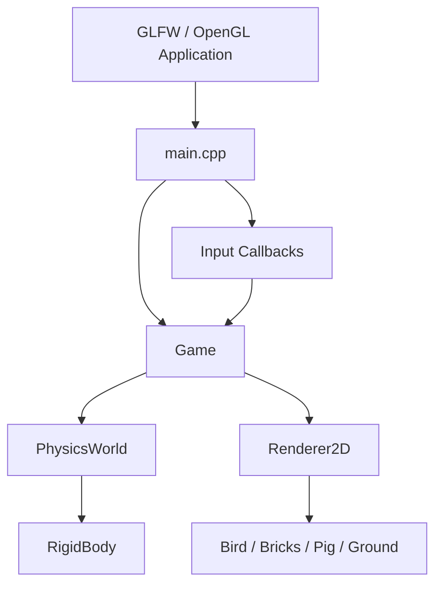

# COMP8610 Research Project 1

**Option 2: Interactive 2D Angry Birds Simulation**

**Author:** [Your Name / Student ID]  
**Course:** COMP8610 Computer Graphics Research Project 1  
**Submission Type:** Individual project report  
**Repository Build:** Verified successfully with CMake on macOS

## 1. Introduction

This project implements an interactive 2D Angry Birds style physics simulation in C++ using OpenGL for rendering and GLFW for windowing and input. The main goal of the assignment is to simulate physically plausible motion rather than scripted animation. The bird is launched by mouse dragging, gravity acts continuously, rigid bodies collide with restitution and friction, and bricks can both translate and rotate after impact. The simulation runs at a fixed timestep of 60 Hz to satisfy the assignment requirement for deterministic physics updates.

The final scene contains the required core elements: a circular bird, a stack of identical rectangular bricks, and a fixed ground plane. In addition, the project includes a pig target as a small gameplay extension, along with trajectory preview and particle effects to improve visual feedback. These additions do not replace the required physics implementation; instead, they sit on top of the same rigid-body simulation framework.

From a software design perspective, the program is separated into a rendering module, a physics module, a game-state/input module, and the main application loop. This separation was important because the assignment explicitly requires that physics logic should not be mixed into the renderer.

## 2. Project Objectives

The implementation was designed to satisfy the following requirements from the assignment specification:

- simulate gravity-driven motion with a fixed timestep of `1/60` seconds;
- allow the player to launch a circular bird by dragging with the mouse;
- simulate collisions between bird and bricks, bricks and bricks, and moving bodies with the ground;
- produce non-ideal bounces using restitution rather than hard-coded velocity reversal;
- allow bricks to rotate when the collision point is off-center;
- provide pause/resume and reset controls;
- keep the simulation stable enough that stacked bricks rest calmly instead of jittering or exploding.

The project also aimed to produce a cleaner game-like presentation than a pure debug view. Therefore, the renderer includes a stylized background, a custom bird, colored bricks, a pig target, slingshot bands, trajectory preview dots, and simple impact particles.

## 3. Implementation Overview

The project is implemented in standard C++17 and built with CMake. The source code is organized into four main files:

- `src/main.cpp`: application startup, GLFW setup, callbacks, fixed-timestep loop;
- `src/Game.cpp`: scene construction, launch interaction, pause/reset logic, game-state transitions;
- `src/Physics.cpp`: rigid-body integration, collision detection, impulse-based response, stabilization;
- `src/Renderer.cpp`: 2D drawing routines and lightweight visual effects.

The core data structures are defined in the header files:

- `include/Renderer.h` defines `Vec2`, `Color`, particle data, and the `Renderer2D` interface;
- `include/Physics.h` defines `RigidBody`, `CollisionInfo`, and `PhysicsWorld`;
- `include/Game.h` defines the bird, brick, pig, and overall `Game` controller.

The scene currently consists of:

- one red bird placed on the slingshot;
- six identical bricks arranged as a pyramid (`3 + 2 + 1`);
- one pig placed above the top brick;
- one fixed ground plane.

This layout was chosen because it is simple, visually readable, and suitable for demonstrating stacking stability, circle-rectangle impact, rectangle-rectangle contact, and rotational response.

## 4. Physics Model

### 4.1 State Variables

Each dynamic object is represented as a rigid body with the following physical state:

- position `(x, y)`;
- linear velocity `(vx, vy)`;
- rotation angle `theta`;
- angular velocity `omega`;
- mass and inverse mass;
- moment of inertia and inverse inertia;
- shape parameters: radius for circles, half-width/half-height for rectangles;
- material parameters: restitution and friction.

Static bodies are represented by setting inverse mass and inverse inertia to zero. In this project the ground is modeled as an infinite static horizontal plane, while the bird, bricks, and pig are dynamic after initialization. During aiming, the bird is temporarily kept static so it can be moved directly by the slingshot interaction.

### 4.2 Mass and Inertia

Mass properties are computed from simple density-based formulas:

- circle mass: `m = density * pi * r^2`;
- circle inertia: `I = 0.5 * m * r^2`;
- rectangle mass: `m = density * w * h`;
- rectangle inertia: `I = m * (w^2 + h^2) / 12`.

These formulas are standard rigid-body approximations for 2D simulation and are sufficient for this assignment. Because angular velocity is updated through the inverse inertia, off-center impacts naturally cause a rectangle to spin more easily when its inertia is smaller.

### 4.3 Time Integration

Physics is updated using a fixed timestep:

`dt = 1 / 60 s`

The main loop accumulates frame time and advances the simulation in constant-sized steps. This avoids the instability that often appears when variable frame time is fed directly into the physics solver.

The integrator is semi-implicit Euler:

1. apply acceleration to velocity;
2. apply damping;
3. update position from the new velocity;
4. update rotation from angular velocity.

Gravity acts in the positive screen-space y direction because the rendering coordinate system uses y-down. The physics world applies:

- gravity to all non-static bodies;
- linear damping (`0.998`) to reduce endless sliding;
- angular damping (`0.992`) to reduce endless spinning.

Velocity and angular velocity are also clamped to upper limits. This is not a perfect substitute for continuous collision detection, but it reduces tunneling and helps keep the simulation numerically stable during strong impacts.

## 5. Collision Detection

The simulation handles three main types of contact:

- circle vs. rectangle;
- rectangle vs. rectangle;
- body vs. ground.

### 5.1 Circle vs. Rectangle

For bird-brick and pig-brick interactions, the circle center is transformed into the rectangle's local coordinate system. The closest point on the rectangle is found by clamping the local circle center to the rectangle extents. If the distance from the circle center to this closest point is less than the radius, a collision is detected.

This method also supports rotated rectangles because the test is performed in the rectangle's local frame. If the circle center lies inside the rectangle, the algorithm pushes the closest point to the nearest edge so that a valid collision normal and penetration depth can still be computed.

### 5.2 Rectangle vs. Rectangle

Brick-brick collisions are detected using the Separating Axis Theorem (SAT). Four candidate axes are tested:

- the two local axes of rectangle A;
- the two local axes of rectangle B.

Both rectangles are projected onto each axis. If any axis shows separation, there is no collision. Otherwise, the axis with minimum overlap is selected as the collision normal, and the overlap becomes the penetration depth.

SAT is more appropriate here than a simple axis-aligned bounding box test because the bricks are allowed to rotate physically. This means the collision detection remains consistent with the visual orientation of the bricks after impact.

### 5.3 Ground Contact

The ground is modeled as a fixed horizontal plane at `y = groundY`. For circles, the bottom point of the shape is tested against the plane. For rectangles, all four rotated corners are checked, and the deepest penetrating corner determines the penetration depth. The average x-position of supporting corners is used as an approximate contact point.

This approach is simple but effective for a side-view 2D simulation. It also supports tilted bricks resting on one or two corners.

## 6. Collision Response

### 6.1 Impulse-Based Response

The assignment explicitly requires realistic bounce rather than fake scripted reversal, so this project uses impulse-based collision response. For a contact normal `n`, the relative velocity at the contact point is computed first. If the bodies are already separating, the solver skips the collision.

The normal impulse magnitude is:

`j = -(1 + e) * v_rel_n / (sum of inverse masses and angular terms)`

where `e` is the combined restitution coefficient. The impulse is then applied to both linear velocity and angular velocity. Because the contact point may be offset from the center of mass, the torque term changes angular velocity and causes the brick to rotate.

This is the key mechanism that produces believable motion when the bird strikes the edge or corner of a brick.

### 6.2 Friction

After the normal impulse is applied, the solver recomputes the relative velocity and extracts the tangential component. A Coulomb friction impulse is then applied, limited by `mu * |j|`, where `mu` is the combined friction coefficient.

Friction has two important roles in this project:

- it reduces unrealistic infinite sliding after impact;
- it improves resting stability when multiple bricks are stacked.

The ground uses a slightly more absorbent response than body-body collision. Its restitution is scaled down so that impacts with the floor lose more energy, which makes the scene feel more believable and also helps the system settle faster.

### 6.3 Positional Correction

Impulse response alone is not enough. Due to discrete timesteps, bodies may still overlap after collision detection. To fix this, the solver applies Baumgarte-style positional correction using a penetration slop and a correction percentage. The correction pushes bodies apart along the collision normal in proportion to their inverse masses.

This positional correction is essential for avoiding visible sinking into the ground or interpenetration between bricks.

## 7. Stability and Numerical Robustness

Stability was one of the most important goals of the assignment, especially for a Distinction or High Distinction grade. Several measures were introduced to keep the simulation calm and controllable:

### 7.1 Multiple Solver Iterations

Collision resolution is repeated for several iterations per physics step (`collisionIterations = 6`). Iterative solving improves the behavior of stacked objects because one contact resolution can affect nearby contacts. Without repeated passes, the tower was noticeably less stable.

### 7.2 Damping

Small linear and angular damping values are applied every timestep. Their purpose is not to fake motion, but to remove energy that remains due to numerical error or repeated micro-collisions. This greatly reduces endless jitter.

### 7.3 Resting Sleep

After collision resolution, bodies that are supported and moving below a small speed threshold are forced to sleep by setting their linear and angular velocities to zero. This prevents bricks from vibrating forever when they should already be at rest.

### 7.4 Velocity Clamping

Extremely high velocities can cause fast bodies to pass through thin objects in a single frame. This project does not implement full continuous collision detection, so linear and angular velocities are clamped to conservative limits. This reduces the risk of tunneling in a simple and practical way.

### 7.5 Material Tuning

The restitution values are deliberately non-ideal and relatively low. If restitution is too high, the tower becomes noisy and repeated contacts amplify instability. Friction values were also tuned upward to help the bricks settle after impact instead of sliding unrealistically across the ground.

## 8. Interaction Design

### 8.1 Slingshot Launch

The bird starts in the `Aiming` state. When the player clicks near the bird and drags the mouse, the bird follows the pull point. The drag position is clamped to a maximum pull radius so the interaction remains predictable and the launch speed is bounded.

On mouse release, the launch direction is computed from the rest position to the pulled position. The launch velocity is proportional to the pull vector, so a larger drag distance creates a faster launch. If the drag distance is too small, the bird snaps back to the original position instead of launching.

This interaction satisfies the assignment requirement that longer drag should mean faster launch.

### 8.2 Trajectory Preview

While dragging, the renderer draws a sequence of dots representing the predicted ballistic path under constant gravity. This preview is not used by the physics engine; it is only a visual helper computed from the same launch velocity and gravitational acceleration.

### 8.3 Pause and Reset

Two essential user controls are implemented:

- `R`: reset the entire scene to its initial state;
- `Space`: pause and resume the physics simulation.

Pausing stops the physics step completely. An extra usability fix was added so that pausing during aim cancels the drag and restores the bird to the slingshot instead of allowing a delayed unintended launch.

### 8.4 Additional Game Feedback

The simulation changes from `Aiming` to `Flying`, and later to `Settled` when the bird slows down on the ground or leaves the play area. The game also removes the pig if it is hit strongly enough by the bird or if it reaches the ground. Small particle bursts are spawned on launch and pig removal to make impacts easier to read visually.

## 9. Rendering and Visual Design

The renderer uses custom OpenGL drawing code instead of external sprite libraries. This keeps the project lightweight and makes the geometry easy to map to the physics state.

The following objects are drawn directly from simulation data:

- bird: filled circle with outline and facial details;
- pig: filled circle with simple cartoon features;
- bricks: rotated quads with outlines and stripe details;
- ground: large horizontal layered rectangle;
- slingshot: line-based stylized structure;
- particles: short-lived circles for impact feedback.

Because the bricks are rendered using their current rotation angle from the rigid-body state, the visual representation remains consistent with the SAT-based collision model.

The windowing layer also accounts for framebuffer scaling on macOS Retina displays by converting mouse coordinates from window space to framebuffer space. Without this correction, aiming would be visually offset from the actual bird position.

## 10. Program Architecture

The software architecture is intentionally modular.



The responsibilities of each layer are:

- `main.cpp`: owns the window, OpenGL context, callback registration, and fixed-timestep loop;
- `Game`: owns scene objects, high-level states, input interpretation, and synchronization between physics and rendering;
- `PhysicsWorld`: updates body motion and resolves collisions;
- `Renderer2D`: draws the current state only and does not modify physics.

This design follows the assignment recommendation to separate physics, rendering, input, and the main loop.

## 11. Problems Encountered and Solutions

### 11.1 Resting Jitter in the Brick Tower

When rigid bodies are stacked, tiny penetration errors can repeatedly trigger contact responses. Early versions of the scene showed small but visible vibration in resting bricks. This was improved by combining:

- multiple collision iterations;
- lower restitution;
- damping;
- positional correction;
- a support-based sleep rule.

Together, these changes made the pyramid settle much more calmly.

### 11.2 Excessive Bouncing

If the bird and bricks used high restitution, collisions looked energetic but unrealistic for the assignment. More importantly, high restitution made the whole tower unstable. Lower non-ideal restitution values produced better energy loss and more believable behavior.

### 11.3 Ground Penetration

Discrete simulation can cause moving objects to dip slightly below the ground before a response is computed. This was addressed by explicit penetration correction after ground collision response. Without that correction, objects could gradually sink or appear to vibrate against the floor.

### 11.4 Fast Motion and Tunneling Risk

A very strong slingshot launch can push the bird to high speed. Full continuous collision detection was beyond the scope of this assignment, so the solver instead limits maximum linear and angular velocity. This is a practical compromise that improves robustness without greatly increasing complexity.

### 11.5 Input Accuracy on High-DPI Displays

Mouse coordinates reported by the windowing system do not always match the framebuffer coordinate system on Retina displays. This caused aim offsets during testing. The issue was solved by computing separate x/y scale factors from window size and framebuffer size and applying them to mouse input before passing the coordinates into the game logic.

## 12. Results

The completed project successfully demonstrates the required physics behaviors:

- the bird is launched by drag-and-release interaction;
- gravity accelerates moving bodies continuously;
- bricks translate and rotate after impact;
- collisions use restitution and friction rather than scripted animation;
- the ground remains fixed;
- pause and reset controls work correctly;
- the simulation builds and runs successfully with the provided CMake configuration.

The overall visual result is closer to a small game prototype than a raw physics testbed. The scene remains understandable to the viewer while still being driven by genuine rigid-body simulation.

Suggested screenshots to include in the final PDF version:

- **Figure 1.** Initial aiming state with slingshot and brick pyramid.  
  `[Insert screenshot here]`

- **Figure 2.** Trajectory preview while the bird is being dragged.  
  `[Insert screenshot here]`

- **Figure 3.** Collision moment showing brick rotation and tower collapse.  
  `[Insert screenshot here]`

- **Figure 4.** Paused state overlay and final settled result.  
  `[Insert screenshot here]`

## 13. Limitations and Future Improvements

Although the implementation satisfies the assignment goals, several limitations remain:

- collision response uses a simplified contact point approximation for rectangle-rectangle impacts;
- there is no continuous collision detection, so very extreme speeds could still produce tunneling;
- there is only one bird and one predefined level layout;
- the project does not yet include score tracking or multi-shot gameplay;
- rendering is stylized but still intentionally simple compared with a full game engine.

If the project were extended further, the most useful upgrades would be:

- continuous collision detection for fast projectiles;
- multiple birds and more level configurations;
- a scoring system and clearer win/lose conditions;
- on-screen HUD text for state and controls;
- export or logging tools for quantitative analysis of collisions.

## 14. Conclusion

This project demonstrates a complete 2D Angry Birds style simulation based on real-time rigid-body physics. The program uses fixed-timestep integration, shape-specific collision detection, impulse-based response with restitution and friction, angular motion from off-center contact, and multiple stabilization techniques to keep the system controllable and visually believable.

The most important achievement of the project is that the observed motion is not faked. The bird, bricks, and pig move because of forces, velocities, impulses, and rotational dynamics. At the same time, the software structure remains clean: physics, rendering, input, and application control are separated into clear modules. This makes the code easier to understand, debug, and extend.

Overall, the project meets the main assignment requirements and provides a solid foundation for further gameplay and graphics improvements.

## Appendix A. Controls

- Left mouse drag: pull and aim the bird
- Left mouse release: launch the bird
- `R`: reset the scene
- `Space`: pause/resume physics
- `Esc`: quit the application

## Appendix B. Build Instructions

This version was verified on macOS with CMake, GLFW, and system OpenGL.

```bash
cmake -S . -B build
cmake --build build
./build/AngryBird
```

## Appendix C. References

1. Ericson, C. *Real-Time Collision Detection*. Morgan Kaufmann, 2005.
2. Millington, I. *Game Physics Engine Development*. CRC Press, 2010.
3. Baraff, D. "Analytical Methods for Dynamic Simulation of Non-penetrating Rigid Bodies." *SIGGRAPH*, 1989.
4. Course specification for COMP8610 Research Project 1, Option 2.
